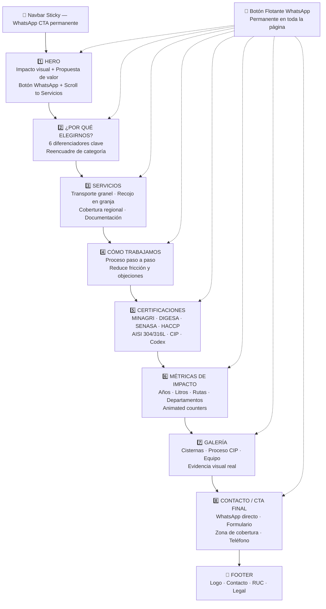

# Plan Web — BD & Mariafe Transportes
## 2. Arquitectura de la Web

---

### 2.1 Estructura de Secciones

| # | ID Sección | Nombre | Propósito Narrativo | Layout | Animación |
| :- | :--------- | :----- | :------------------ | :----- | :-------- |
| 1 | `hero` | Hero / Inicio | Primera impresión: impacto visual inmediato, propuesta en 3 segundos, WhatsApp visible | Full-screen 100vh, texto centrado-izquierda, canvas derecha | Escena 3D: flujo de partículas moleculares reactivas al cursor |
| 2 | `propuesta` | ¿Por qué elegirnos? | Reencuadrar la categoría: no transporte, sino custodia sanitaria. Reflejar pain points del cliente | Grid 2 cols (texto + tarjetas de diferenciadores) | Stagger entry de cards + geometría 3D flotante (acero wireframe) |
| 3 | `servicios` | Nuestros Servicios | Detalle de qué se ofrece: transporte, recojo, cobertura, documentación | Grid 3 cols en desktop, 1 col mobile | Cards con hover 3D tilt + scroll-triggered stagger |
| 4 | `proceso` | Cómo Trabajamos | Reducir fricción: el cliente sabe exactamente qué esperar paso a paso | Timeline vertical con steps numerados | Stroke SVG animation + fade-in secuencial por step al scroll |
| 5 | `certificaciones` | Certificaciones y Estándares | Construir credibilidad máxima con normativas verificables | Grid de badges + tabla de normativas | Flip-card reveal al scroll + badge glow animation |
| 6 | `metricas` | Impacto en Números | Credibilidad con escala: años, litros, rutas, departamentos | Full-width dark section con counters grandes | Animated counters (count-up) al entrar en viewport |
| 7 | `galeria` | Galería de Confianza | Evidencia visual real: cisternas, proceso CIP, equipo humano | Masonry grid responsivo | Reveal animado por filas + lightbox con zoom |
| 8 | `contacto` | Contactar Ahora | Conversión final: máxima facilidad para contactar | Split layout: WhatsApp primario izquierda / formulario derecha | Partículas de fondo + slide-in del formulario |
| — | `navbar` | Navegación | Orientación y acceso directo al CTA en todo momento | Sticky top con glassmorphism al scroll | Blur + shadow aparece al scrollear >80px |
| — | `footer` | Footer | Datos legales, contacto, redes sociales | 3 columnas desktop / stack mobile | Fade-in simple |

---

### 2.2 Diagrama de Flujo de Secciones



---

### 2.3 Especificaciones de Navegación

**Tipo de nav:** Sticky top navbar — transparente en el hero, glassmorphism azul oscuro con blur al scrollear.

**Ítems del menú (máximo 6):**
```
Inicio | Servicios | Certificaciones | Galería | Contacto | [💬 WhatsApp — botón verde]
```

**Comportamiento al scroll:**
- Estado inicial (0–80px): navbar totalmente transparente sobre el hero
- Estado scroll (>80px): `background: rgba(15, 42, 69, 0.85)` + `backdrop-filter: blur(16px)` + `box-shadow` sutil
- Transición: `transition: all 0.4s cubic-bezier(0.16, 1, 0.3, 1)`

**Smooth scroll:** `scroll-behavior: smooth` + offset de 80px para compensar el navbar sticky.

**Mobile — menú hamburguesa:**
- Icono hamburguesa → menú fullscreen overlay (no sidebar) con fondo `#0F2A45` al 95% opacidad
- Links en tamaño grande (36px), centrados verticalmente
- Botón de WhatsApp prominente dentro del menú mobile
- Cierre: tap fuera del menú o ícono X
- Animación: fade + slide-down del overlay

**Dot navigation lateral (desktop HIGH):**
- 8 puntos laterales derechos para navegación por sección, visibles en scroll
- Tooltip con nombre de sección al hover
- Punto activo: filled en `#25D366` (verde WhatsApp)

---

### 2.4 Tipología de Layouts por Sección

**HERO (full-screen split):**
```
┌─────────────────────────────────────────┐
│  NAVBAR (transparente)                  │
├──────────────────────┬──────────────────┤
│                      │                  │
│  Headline H1 (bold)  │   Canvas 3D      │
│  Subheadline         │   (partículas)   │
│  ─────               │                  │
│  [💬 WhatsApp]       │                  │
│  [Ver Servicios ↓]   │                  │
│                      │                  │
│  Trust badges        │                  │
└──────────────────────┴──────────────────┘
  Mobile: stack vertical, canvas arriba 50vh
```

**SERVICIOS (grid 3 cols):**
```
┌──────────────┬──────────────┬──────────────┐
│  Card        │  Card        │  Card        │
│  Servicio 1  │  Servicio 2  │  Servicio 3  │
│  [Hover tilt]│  [Hover tilt]│  [Hover tilt]│
└──────────────┴──────────────┴──────────────┘
  Mobile: 1 col, full-width cards
```

**CONTACTO (split 50/50):**
```
┌──────────────────────┬──────────────────────┐
│   PRIMARY            │   SECONDARY          │
│                      │                      │
│   💬 WhatsApp        │   📋 Formulario      │
│   📞 Teléfono        │   Nombre             │
│   ✉️ Email           │   Empresa            │
│                      │   Teléfono           │
│   [Mapa / Zona       │   Región             │
│    de cobertura]     │   Mensaje            │
│                      │   [Enviar]           │
└──────────────────────┴──────────────────────┘
  Mobile: stack, WhatsApp primero
```

---

### 2.5 Responsive Breakpoints

| Breakpoint | Ancho | Comportamiento |
| :--------- | :---- | :------------- |
| Mobile S | 360px | Layout 1 columna, texto 16px mínimo, nav hamburguesa |
| Mobile M | 480px | Ligeros ajustes de padding |
| Tablet | 768px | Layout 2 columnas en algunas secciones |
| Desktop | 1024px | Layout completo, nav horizontal |
| Desktop L | 1280px | Máximo ancho contenedor: 1200px centrado |
| Desktop XL | 1440px+ | Espaciado más generoso, canvas 3D más grande |

---

### 2.6 Decisiones de UX Críticas

1. **WhatsApp PRIMERO, siempre:** En mobile, el botón flotante de WhatsApp debe tener `z-index: 9999` y nunca estar cubierto por ningún elemento. Tamaño mínimo: 56×56px (área táctil segura de 44px+ según WCAG).

2. **Sin scroll-jacking:** El scroll debe ser nativo. GSAP ScrollTrigger solo para efectos de reveal — nunca para controlar la velocidad del scroll del usuario.

3. **CTA en cada sección:** Cada sección que muestra servicios o diferenciadores termina con un botón de acción (WhatsApp o formulario). El visitante nunca debe buscar cómo contactar.

4. **Información de contacto en el header:** Número de WhatsApp visible en el botón del navbar en desktop desde el primer momento.

5. **Carga progresiva:** El hero carga primero con máxima prioridad. Las secciones inferiores y el canvas 3D se cargan con lazy loading para no bloquear el LCP (Largest Contentful Paint).
