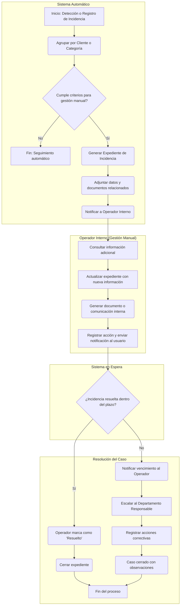
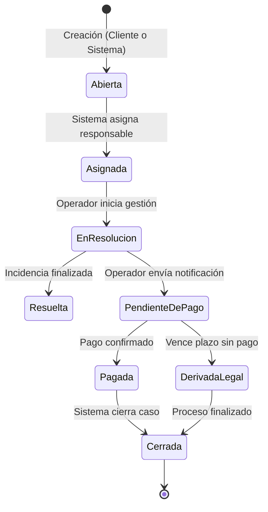
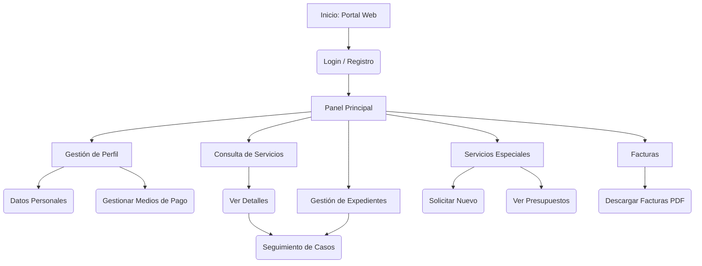

## 1. Objetivo y Alcance

### 1.1 Objetivo general

Describir brevemente el propósito de la aplicación, su contexto y los beneficios esperados.

### 1.2 Alcance del sistema

* Qué funcionalidades cubre.
* Módulos en los que se divide.
* Procesos principales.

### 1.3 Límites del sistema (Fuera de Alcance)

* Qué procesos o módulos quedan fuera del alcance.
* Límites del sistema y principales interacciones externas.

---

## 2. Actores y Roles

| Actor / Rol                                    | Descripción                                                                                                                 | Permisos / Responsabilidades                                                                                                                                                                                                                                                                                                                                                                                                                                                                                                                                                                                                                                                                                                                                                                                                                                                                                                                                                                            |
| ---------------------------------------------- | --------------------------------------------------------------------------------------------------------------------------- | ------------------------------------------------------------------------------------------------------------------------------------------------------------------------------------------------------------------------------------------------------------------------------------------------------------------------------------------------------------------------------------------------------------------------------------------------------------------------------------------------------------------------------------------------------------------------------------------------------------------------------------------------------------------------------------------------------------------------------------------------------------------------------------------------------------------------------------------------------------------------------------------------------------------------------------------------------------------------------------------------------- |
| **Usuario Final / Cliente Web**                | Persona o entidad que accede al sistema a través del portal en línea para gestionar su cuenta y servicios asociados.        | - **Gestión de Cuenta:** Crear una cuenta, registrar y actualizar datos personales. <br> - **Consultas:** Visualizar su historial de uso, operaciones y reportes asociados. <br> - **Incidencias:** Registrar reclamaciones o incidencias y realizar seguimiento del estado. <br> - **Solicitudes de Servicio:** Enviar solicitudes personalizadas o especiales y aceptar propuestas. <br> - **Facturación:** Consultar pagos realizados y descargar comprobantes o facturas.                                                                                                                                                                                                                                                                                                                                                                                                                                                                                                                           |
| **Operador Interno / Agente de Soporte (SGI)** | Usuario interno responsable de la atención al cliente, la validación de información y la supervisión operativa del sistema. | - **Gestión de Usuarios:** Validar altas de nuevos clientes, revisar documentación y asociar identificadores o servicios. <br> - **Gestión de Proveedores:** Administrar la información de proveedores o emisores de servicios y sus parámetros de facturación. <br> - **Gestión de Condiciones Especiales:** Marcar usuarios o servicios con condiciones preferenciales, validar documentos y mantener registros actualizados. <br> - **Gestión de Incidencias:** Registrar, analizar y resolver incidencias o reclamaciones, incluyendo la consulta de datos en sistemas externos cuando sea necesario. <br> - **Gestión de Solicitudes:** Crear solicitudes en nombre del cliente, coordinar revisiones y confirmar la finalización del servicio. <br> - **Supervisión Operativa:** Asignar tareas, monitorear flujos automatizados y validar resultados de procesos. <br> - **Facturación y Reportes:** Gestionar la facturación, registrar referencias y comunicar resultados a sistemas externos. |

---

## 3. Requerimientos Funcionales

### 3.1 Módulo: Gestión de Usuarios

| ID    | Requerimiento             | Descripción                                                                                                       |
| :---- | :------------------------ | :---------------------------------------------------------------------------------------------------------------- |
| RF-01 | Autenticación de Usuarios | El sistema debe implementar autenticación segura con contraseñas robustas y opción de autenticación en dos pasos. |
| RF-02 | Alta de Usuarios (Web)    | El sistema debe permitir a los clientes solicitar su alta e introducir sus datos personales y de contacto.        |

---

## 4. Requerimientos Técnicos

### 4.1 Infraestructura

Servidor o hosting requerido, sistema operativo, base de datos y entorno de ejecución.

### 4.2 Software

Frameworks y librerías principales, compatibilidad con navegadores, dependencias externas.

### 4.3 Seguridad

Autenticación, cifrado de datos y cumplimiento normativo.

### 4.4 Rendimiento

Tiempos de respuesta, concurrencia esperada y disponibilidad mínima (SLA).

---

## 5. Historias de Usuario

### 5.1 Módulo: Gestión de Usuarios

#### **HU-01: Alta de nuevo cliente (Web)**
**Como** cliente (usuario web)
**Quiero** solicitar un alta de usuario e introducir mis datos personales
**Para** crear mi perfil en el sistema.

**Criterios de aceptación:**
- [ ] El sistema debe permitir crear un perfil de usuario.
- [ ] Durante el alta, el cliente puede introducir nombre, contacto y otros datos relevantes.
- [ ] La alta quedará pendiente de validación por un Operador del SGI.
- [ ] El usuario podrá registrar sus medios de pago preferidos.

**ID Requerimientos relacionados:** RF-GU-01, RF-GU-03, RF-GU-04

---

## 6. Casos de Uso

#### CU-01: Gestionar Incidencia de Servicio (Operador)

* **ID HU Asociada:** HU-13

* **Descripción:** Flujo manual del Operador para gestionar una incidencia reportada por el sistema o por un usuario, desde la verificación de los datos hasta el cierre del caso.

* **Actor Principal:** Operador Interno (SGI).

* **Actores Secundarios:** Sistemas Externos de Información (por ejemplo, bases de datos o servicios de validación).

* **Precondiciones:**

  * Existe una incidencia registrada en el sistema (de manera automática o por un usuario).

* **Flujo Principal:**

  1. El Operador recibe la notificación y abre el expediente asociado.
  2. El Operador consulta la información necesaria en los sistemas externos de validación.
  3. Registra y actualiza los datos relevantes en el expediente.
  4. El sistema genera un documento interno de comunicación o seguimiento.
  5. El Operador envía la comunicación correspondiente y actualiza el estado de la incidencia.
  6. El sistema inicia el seguimiento automático dentro de un plazo definido.
  7. Una vez confirmada la resolución, el Operador actualiza el estado como “Resuelto”.
  8. El sistema archiva automáticamente el caso.

* **Postcondiciones:**

  * El expediente queda cerrado como “Resuelto” y disponible para consulta en el historial.

---

## 7. Diagramas de Procesos

### 7.1. Flujo de Gestión de Incidencias de Servicio

Este diagrama representa el proceso completo de atención a incidencias o reclamaciones, desde su detección o registro inicial hasta la resolución y cierre del caso.



---

## 8. Integraciones con Otros Sistemas

| Sistema                            | Tipo de Integración     | Propósito                                                                                                                                                                                                         | Tecnología / Protocolo |
| :--------------------------------- | :---------------------- | :---------------------------------------------------------------------------------------------------------------------------------------------------------------------------------------------------------------- | :--------------------- |
| **ERP Empresarial (ERPEX)**        | API / Servicio (Salida) | **Contabilización de Facturación:** <br> - Informar a ERPEX sobre facturación de servicios y clientes. <br> - Gestionar facturas a entidades públicas y privadas. <br> - Registrar abonos y descuentos aplicados. | HTTPS / JSON           |
| **Servicio Fiscal Nacional (SFN)** | Servicio (Vía ERPEX)    | **Cumplimiento Fiscal:** <br> - Garantizar que las facturas comunicadas por ERPEX sean notificadas al SFN conforme a la normativa vigente.                                                                        | HTTPS / XML            |

---

## 9. Diagramas de Estados

### 9.1. Diagrama de Estados: Incidencia / Reclamación

Este diagrama modela el ciclo de vida de un expediente, desde su apertura hasta su cierre, ya sea por resolución, pago o derivación.



---

## 10. Interfaces de Usuario

### 10.1. Interfaces del Portal Web del Cliente (P-WEB)

| Pantalla (ID)                   | Tipo       | Descripción general y Componentes Clave                                               | Roles con acceso | Historia(s) de Usuario | 
| :------------------------------ | :--------- | :------------------------------------------------------------------------------------ | :--------------- | :--------------------- |
| **P-WEB-01: Login / Registro**  | Formulario | Autenticación de usuarios con email corporativo y contraseña. Incluye checkbox "Recordarme", enlace de recuperación, mensaje de auditoría. | Cliente          | HU-01 |
| **P-WEB-02: Búsqueda de Usuarios** | Lista | Panel de búsqueda con múltiples filtros (DNI, email, nombre, matrícula, medio de pago, estado). Tabla de resultados paginada, botones de acción (crear, exportar)..                | Cliente          | HU-02, HU-03 |

---

## 11. Diagramas de Navegación

Este diagrama ilustra la estructura de navegación principal para el actor "Cliente" (usuario web), desde el inicio de sesión hasta las secciones clave de autogestión.

### 11.1. Portal Web del Cliente



---

## 12. Prototipo de Interfaz

### P-SGI-01: Pantalla de Login (SAP BTP Cloud Identity Service) - Mantener para todos los prototipos SAPUI5
### Para el logo de SAP usar el logo de SAP
```
+-------------------------------------------------------------------------------------------------+
|                                                                                                 |
|              +------------------------------------------------------------------+               | 
|              |                                                                  |               |
|              |   [Logo del SAP]                                                 |               |
|              |                                                                  |               |
|              |   Iniciar sesión                                                 |               |
|              |   Nombre de la aplicacion                                        |               |
|              |                                                                  |               |
|              |                                                                  |               |
|              |                                                                  |               |
|              |   Correo electrónico o nombre de usuario                         |               |
|              |   [_________________________________________________________]    |               |
|              |                                                                  |               |
|              |   Contraseña                                                     |               |
|              |   [_________________________________________________________]    |               |
|              |                                                                  |               |
|              |   [] Mantener inicio de sesión    ¿Ha olvidado la contraseña?    |               |
|              |                                                                  |               |
|              |                                                                  |               |
|              |                                                                  |               |
|              |                                                                  |               |
|              |                                                                  |               |
|              |                                                                  |               |
|              |                                                                  |               |
|              |                                                                  |               |
|              |                                                   [Continuar]    |               |
|              |                                                                  |               |
|              +------------------------------------------------------------------+               |
|                                                                                                 |
+-------------------------------------------------------------------------------------------------+
```

---

## 13. Pruebas Funcionales

### 13.1. Nombre módulo 01

| ID Prueba | HU / CU       | Pantalla(s)                                                | Actor        | Criterios de Aceptación                                  | Resultado Esperado                                                                                  |
| :-------- | :------------ | :--------------------------------------------------------- | :----------- | :------------------------------------------------------- | :-------------------------------------------------------------------------------------------------- |
| **PF-01** | HU-01 / CU-16 | `P-WEB-B` (Registro)                                       | Cliente      | Cliente completa todos los campos y envía el formulario. | Se crea un usuario en estado “Pendiente de Validación”. El operador recibe una tarea en `P-SGI-C1`. |
| **PF-02** | HU-02 / CU-17 | `P-SGI-C1` (Cola de Altas) <br> `P-SGI-C3` (Ficha Cliente) | Operador SGI | Operador valida el alta.                                 | El usuario pasa a estado “Validado” y puede iniciar sesión.                                         |

---

## 14. Matriz de Trazabilidad

| Requisito                            | Historia(s) de Usuario | Caso(s) de Uso | Pantalla(s)            | Prueba(s)    |
| :----------------------------------- | :--------------------- | :------------- | :--------------------- | :----------- |
| **RF-01:** Autenticación de Usuarios | HU-04                  | CU-25          | `P-WEB-01`, `P-SGI-01` | PF-03, PF-04 |
| **RF-02:** Alta de Usuarios (Web)    | HU-01                  | CU-16          | `P-WEB-01`             | PF-01        |